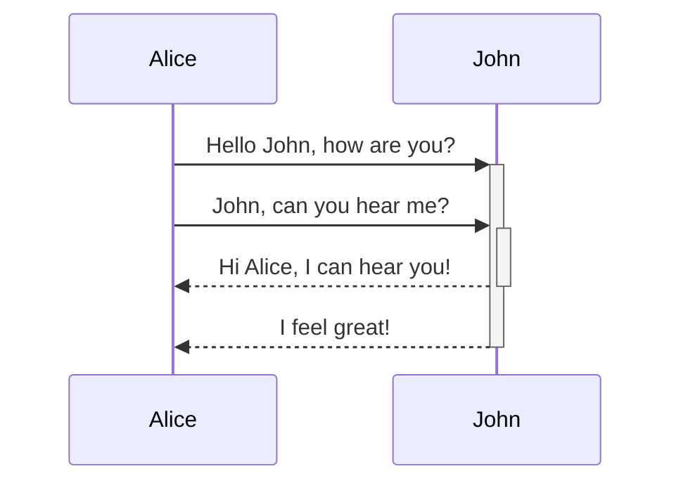

# Cluster Service Callbacks Sequences Specification
***From Navigation Service's Perspective***

<!-- @import "[TOC]" {cmd="toc" depthFrom=1 depthTo=6 orderedList=false} -->

## Terminology

The key words **"MUST"**, **"MUST NOT"**, **"REQUIRED"**, **"SHALL"**, **"SHALL NOT"**, **"SHOULD"**, **"SHOULD NOT"**, **"RECOMMENDED"**, **"MAY"**, and **"OPTIONAL"** in this document are to be interpreted as described in RFC 2119.

- **MUST**: This word, or the terms "REQUIRED" or "SHALL", mean that the definition is an absolute requirement of the specification.
- **MUST NOT**: This phrase, or the phrase "SHALL NOT", means that the definition is an absolute prohibition of the specification.
- **SHOULD**: This word, or the adjective "RECOMMENDED", mean that there may exist valid reasons in particular circumstances to ignore a particular item, but the full implications must be understood and carefully weighed before choosing a different course.
- **SHOULD NOT**: This phrase, or the phrase "NOT RECOMMENDED", mean that there may exist valid reasons in particular circumstances when the particular behavior is acceptable or even useful, but the full implications should be understood and the case carefully weighed before implementing any behavior described with this label.
- **MAY**: This word, or the adjective "OPTIONAL", mean that an item is truly optional.

